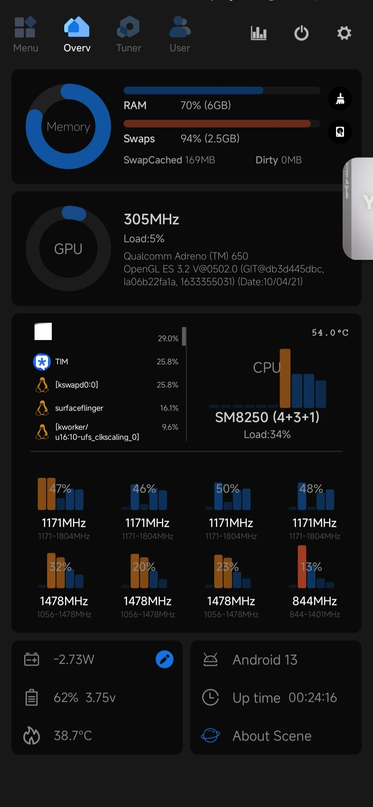
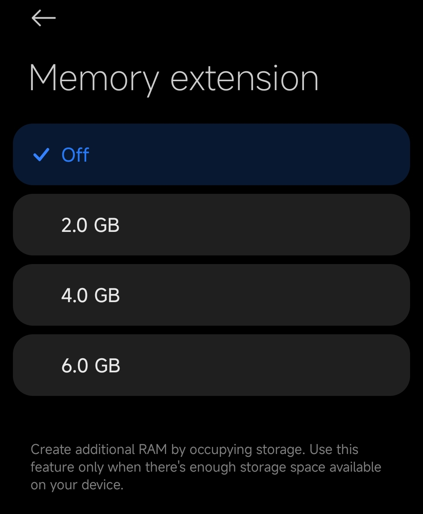
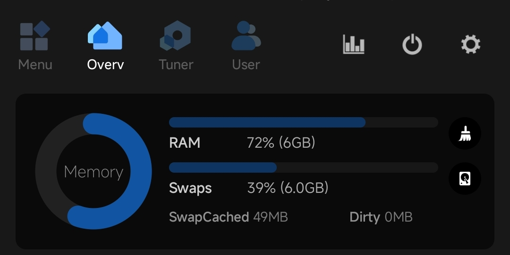

## 起因
这几天在用`Fold Craft Launcher`(简称FCL)维持在mc服务器的上线，其余时间都在使用mcc挂机。但是在使用FCL的时候经常爆出内存不足的错误（`OOM`也就是Out of memory），于是开始尝试查找原因

## Main
稍微了解过手机系统的人都知道，现在的手机也像电脑一样拥有虚拟内存，在内存空间充足时系统一般只会把不常用的内容放进虚拟内存，但是当物理内存占用较高的时候则会将更多的内容放进虚拟内存(以上只是给小白解释一下)

接着，我在系统设置对内存扩展进行了修改，将其修改为了这部手机可修改的最大值`6GB`

可是，当我修改完成后重启手机，其zram为`2.5GB`而不是`6GB` 这使我十分疑惑。遂尝试进行问题排除

*奇妙的是在我尝试关闭内存扩展并重启后，我的内存扩展变成了`6GB` 不是，啊？*

## 问题原因猜测

注意！以下是我的猜测

系统使用的内核默认内存扩展为6GB，关闭后使用了内核配置