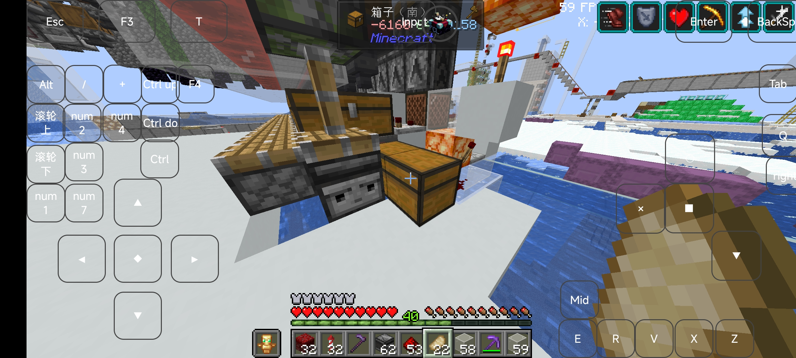
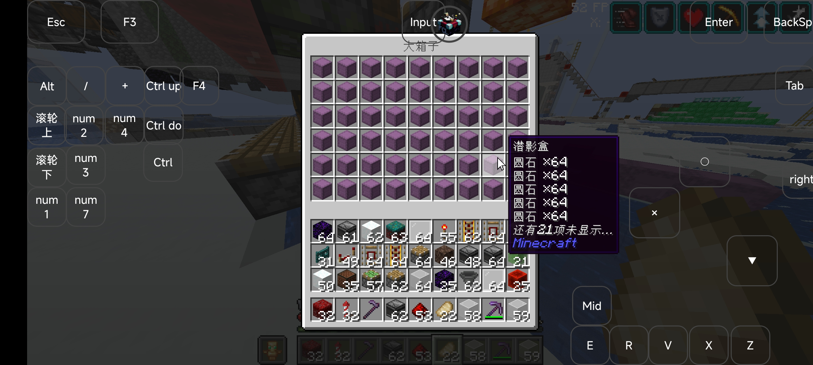
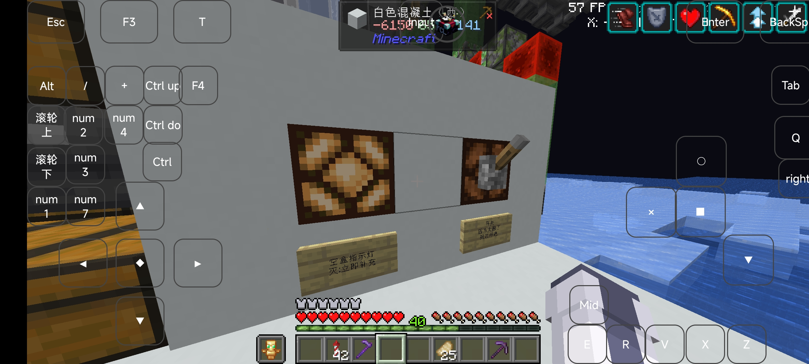

# Intro

本文记录了日啊服务器257号中百万刷石机的使用基本教程

# Main

## 地理位置

鸟居位置: x: -6178 z: -9207 辉月北方，古渊境西北，点画出版社东南

机器精准位置: x-6164 z-9141

地图预览

## 基本能力

以103w的效率产出原石，并配有20*6倍速打包机，以及一个最大储量约为2400w的全锁大宗(~~www我才不会说什么其实是具体的储量我忘记了呢~~)

## 使用方法

对于储量充足的情况:请直接拿取在大宗仓库内的产物，完全不限量，注意，离开时请确认大宗停止运行(即图片所示的箱子内物品不再变化且大宗被上锁)

对于储量不足的情况下

开机流程为:

1.查看空盒仓是否存有较多盒子

最好保证是全满

左侧为空盒指示，在灯灭后，缓存约可运行30分钟，请即刻补充

右侧为开机按键，激活为开

虽然理论上抗卸载，但是我强烈建议你不开启或是挂上bot后再开启

## 注意事项

本机器效率可观，请在服务器闲时开启，tps较低或mspt较高时严禁开启！

关机后请等待打包机停止运行 离开前请确认所有机器停止运行，包括大宗重新锁上等