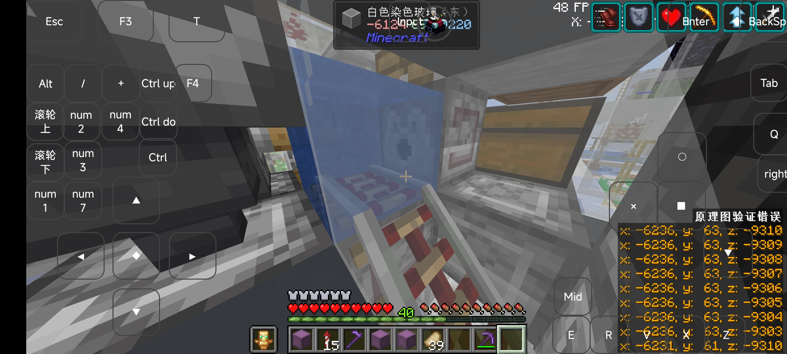
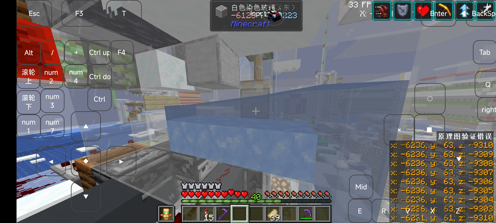
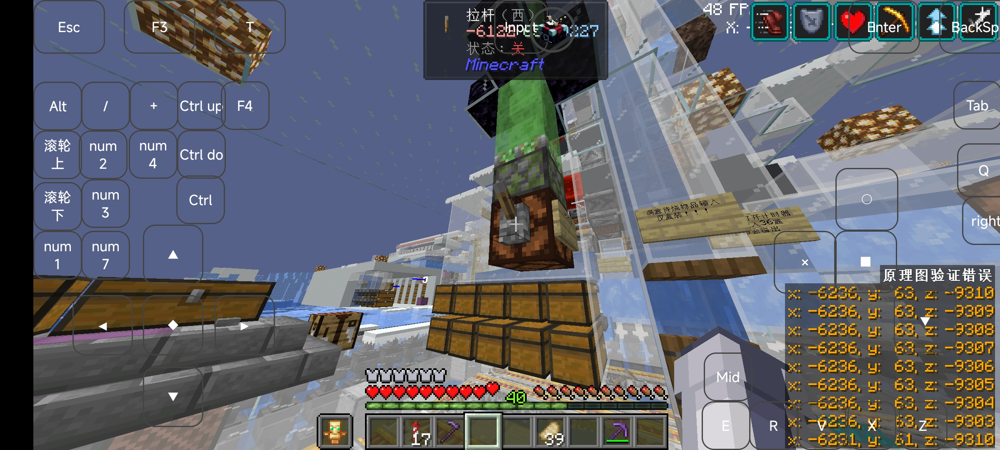

# Intro 

本文介绍日啊服务器257号中320熔炉组的使用基本教程

# Main

## 地理位置

鸟居位置: x: -6178 z: -9207 辉月北方，古渊境西北，点画出版社东南

机器精准位置: x-6122 z-9227

## 基本能力

相较于其他320，这台机器具有以下能力:无损拆包，定时拆包，水道切换，无人值守(其实就是有加载器)

## 使用方法
请不懂的人首先搞清楚在Minecraft中熔炉可以烧什么，参照wiki

## 使用前需要确认的事情

拆包机是否有异物（如漏斗矿车等）

地毯机是否错位

## 使用

盒装少量投入（指的是约5盒以下）: 直接投入即可

盒装大量投入:先丢入一盒，等待5秒后打开左侧头顶的开关，进行计时拆包

打开头顶开关后意味着进行了水道切换，关闭时直接拆包，打开时计时拆包

水道切换

开关

拆包空盒位于最左侧的箱子内，请手动打包（~~我才不会说是因为我还不会做混杂打包~~）

## 其他事项

请不要丢入不可烧制物品，要不然还请自己进去掏炉子