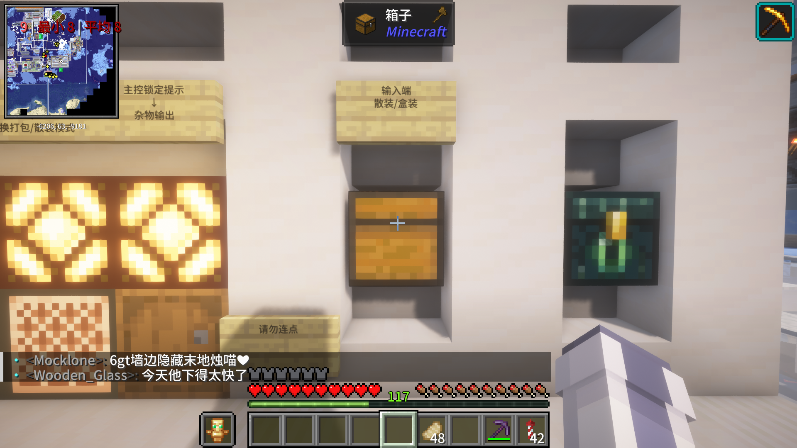

# Intro
本文记录的RIA第257号共鸣点“ **海淀** ”中 **640熔炉组** 的使用方法

# Main
## 地理位置
鸟居位置: x: -6178 z: -9207 辉月北方，古渊境西北，点画出版社东南

机器精准位置: x-6206 z-9186

地图预览

## 基本能力
**640个Minecraft熔炉并行运行，并配有白名单 拆包机 混杂打包 手动装盒 等功能**

## 使用方法
:::caution
注意！:本机器不抗卸载，运行中请勿离开！！ ~~要不然你来修~~ 请先检查空盒正常
:::

本机器配有白名单，可以自动剔除无法烧制的物品，并送入杂物输出的木桶中

### 待烧制物品输入
将待烧制的物品输入坐标为x-6204 y64 z-9181的大箱子中 盒装与散装均可哦！~         （我不建议输入超过一盒的量，还散装输出）

图片实例~：

:::caution
注意！！一次请勿投入超过半个大箱盒物品 否侧无法及时投入 会被mc的扫地阿姨清理掉
:::

然后耐心等待即可前往左侧的产物输出 注意**期间不要离开！！**

### 拿取产物
产物拿取部分：

前往左侧的产物拿取部分

最左侧为散装输出，向右依次为不满盒输出 手动装盒 与 盒装输出

下面讲解不满盒输出 手动装盒 的使用方法

当混杂打包**定时结束或无法继续将物品投掷进入盒子**时，打包机会输出盒子到不满盒输出，此时您应该手动拿取产物，并放入右侧的手动装盒盒子内，当手动装盒处的盒子内部物品满后，机器会自动打盒并放入盒装输出，敲击位于x-6203 y64 z-9191的音符盒（也就是不满盒输出右侧那个）可以进行强制打盒