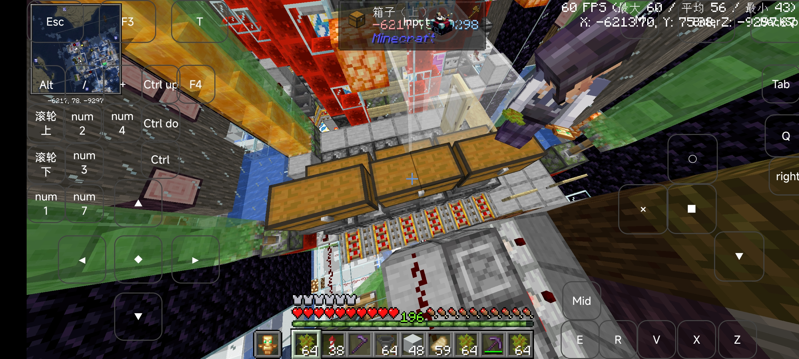
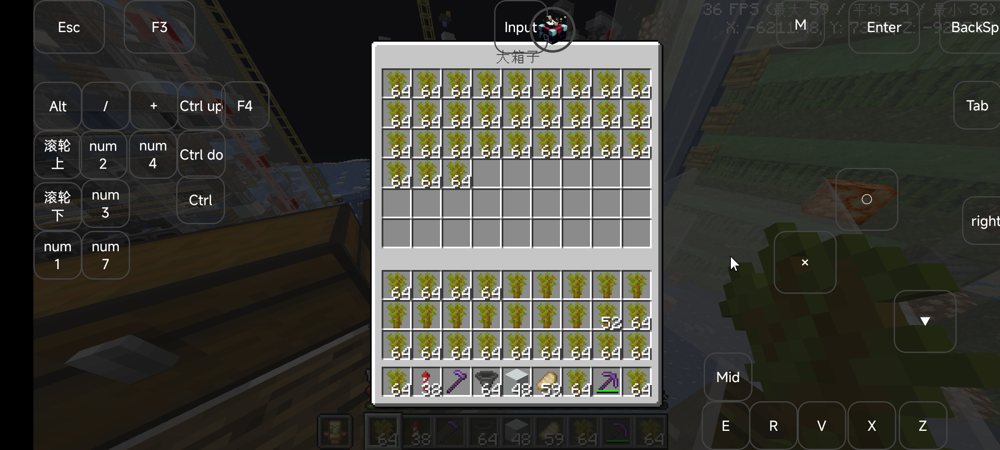
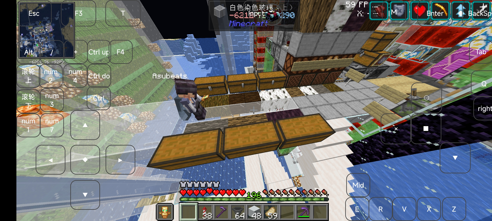
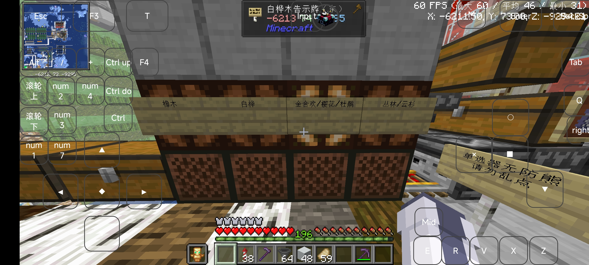
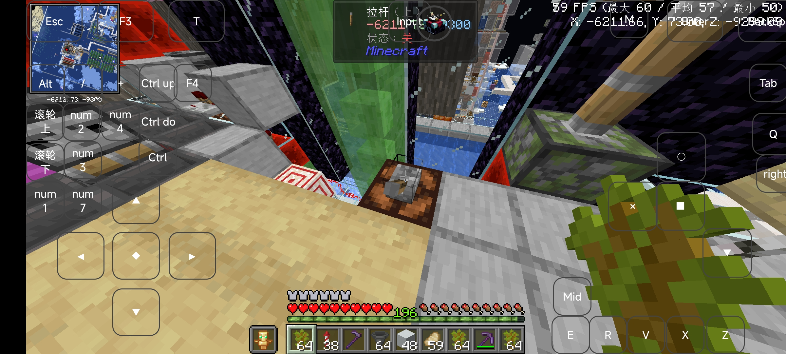
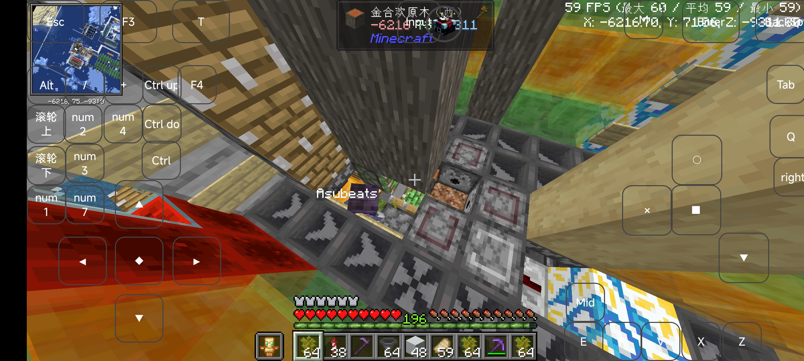
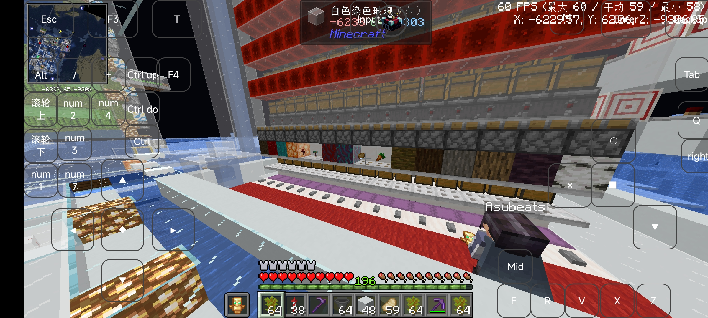

# Intro

本文记录了日啊服务器257号中全树种树场的使用基本教程

# Main

## 地理位置

鸟居位置: x: -6178 z: -9207 辉月北方，古渊境西北，点画出版社东南

机器精准位置: x-6215 z-9303 下层(上层是菌)

## 开机教程

### 1.确认骨粉余量

在如图所示的箱子内确认盒装骨粉为几乎全满，防止一些不必要的问题
~~骨粉拆包机在那么紧凑的地方,你也不想钻进去修吧~~

### 2.拿取树苗

在如图所示的位置拿取树苗，注意，请确保是类似于图中的背包存放形式，方便使用带有自动补货功能的mod与木棍的销毁等

### 3.选择模式

右键单击如图所示的音符盒，注意在进行这项操作前，请先提前关闭mod连点功能，要不然就会”；#；$（@/_+_@/

注意，请等待模式切换所带来的机器变形完成再开机或切换下一模式，涉及橡木模式需要较长时间，千万注意

### 4.开机

打开如图所示的拉杆，注意此时依旧不要开启mod连点

### 5.进入挂机种植位置

进入如图所示的位置，注意，如果挂机位被活塞遮挡无法进入，可以使用/crawl命令进入与离开

### 6.挂机注意事项

请开启mod自动补货功能，使用标准客户端挂机，不要使用bot挂机，开机种植一段时间后，部分树种需要手动丢出投掷器中的木棍以确保树苗供应(长时间挂机建议金合欢)

### 7.产物提取与机器效率

本机器使用了分类大宗，使用基本方式为平视拿盒装，俯视拿散装

丛林45.2k 云杉35.0k 金合欢36.8k 樱花46.4k 杜鹃30.6k 白桦54.1k 橡木45.2k