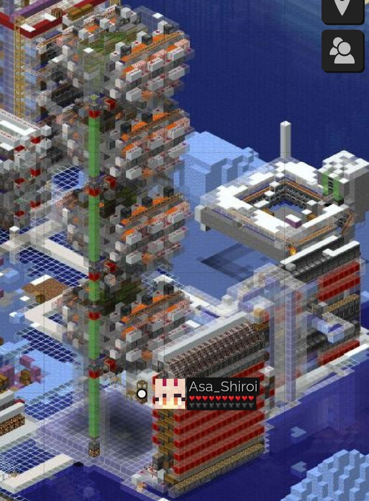
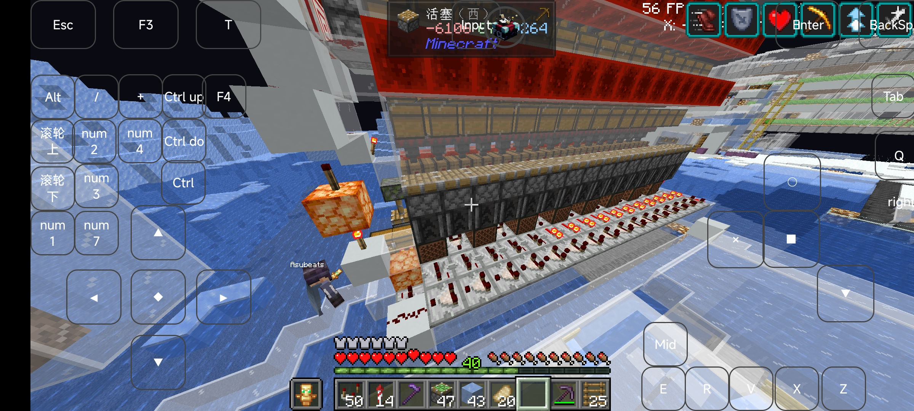
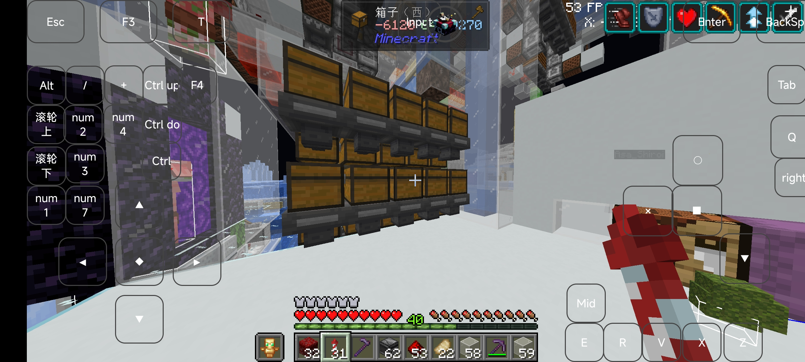
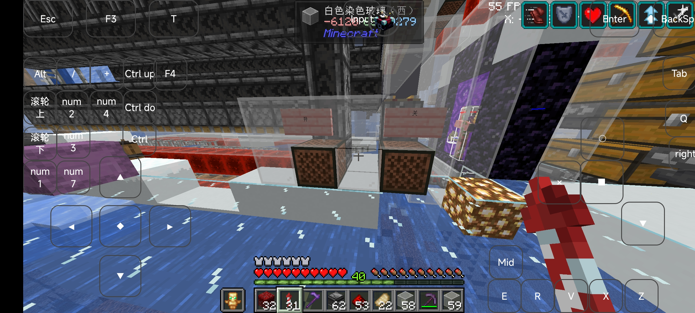
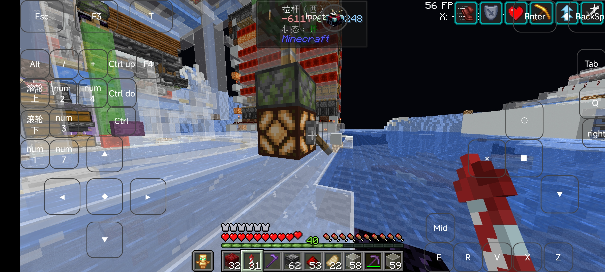

# Intro
本文记录了日啊服务器257号中骨粉机的使用基本教程

# Main
## 地理位置 

鸟居位置: x: -6178 z: -9207 辉月北方，古渊境西北，点画出版社东南

机器精准位置: x-6119 z-9257

地图预览

## 基本能力

以约2.2w/h的效率产出骨粉进入大宗，抗卸载(大概率)，可锁堆肥

## 使用方法

对于储量充足的情况:请直接拿取在大宗仓库内的产物，完全不限量但是还请用多少拿多少，别2kw的储量一下就没喽，注意，离开时请确认大宗停止运行(即图片所示的箱子内物品数量不再变化且大宗被上锁)

## 开机流程

对于需要开机的情况:

1.确认空盒仓库余量，在空盒仓库满仓的情况下，约2.5天会被消耗完毕，所以我强烈建议每48小时进行一次补充空盒操作。注意:若未及时补充会导致打包机损坏~~虽然修起来不麻烦，但是还算不要坏为好~~

2.打开左侧堆肥区，即右键标有“开启”等字样的音符盒，即可统一解锁堆肥区漏斗

3.打开机器开关

4.挂机

前往挂机小房子，建议使用mcc等低负载mc客户端进行挂机，因为骨粉机的原理，对标准客户端负载较大(所谓标准客户端就是比如说你从pcl2启动器启动的mc)，说白了就是挂bot而不是实机挂机

5.关机，先关闭机器开关，再关闭堆肥区漏斗，确认大宗停止运行，方可离开

## 注意事项

本机器开启后若运行不正常请尝试向机器内部的投掷器填充骨粉
